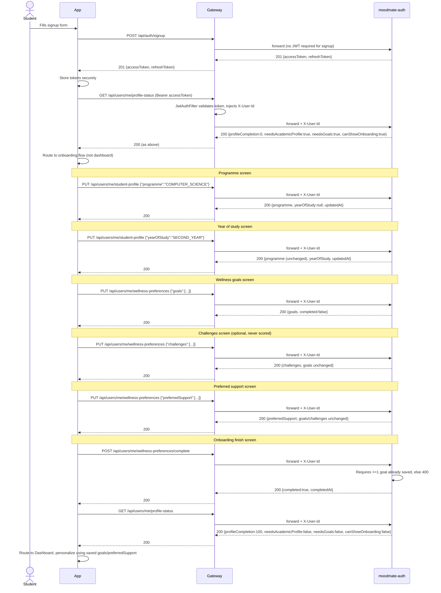
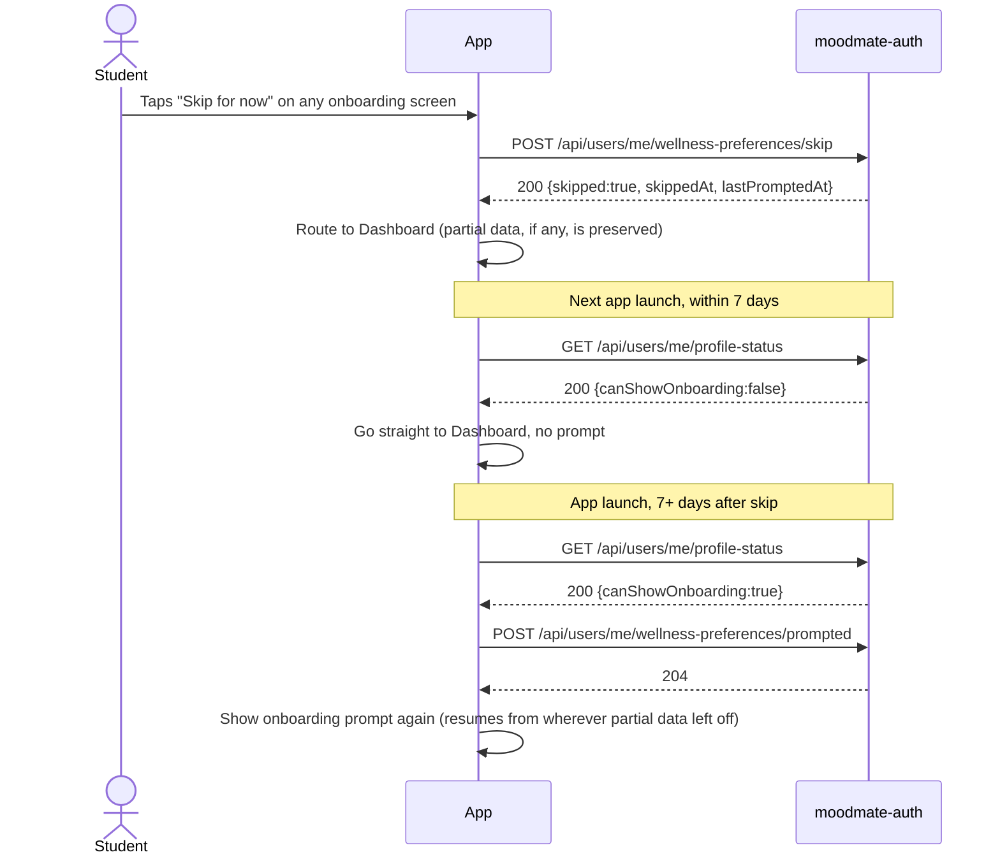
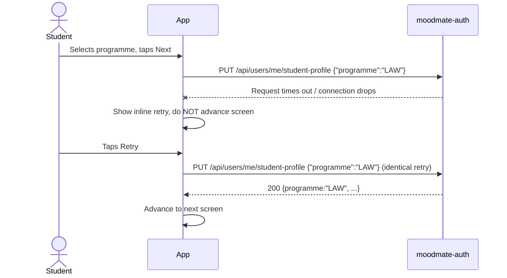
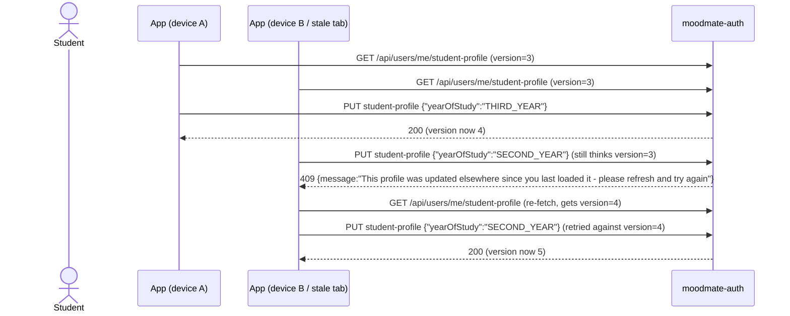
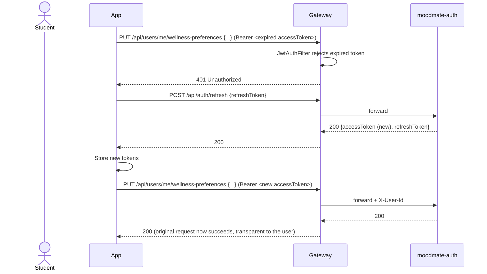

# First-Time Student Journey — Sequence Diagram

Backend/frontend contract for Phase 1C-iii. Covers the complete first-run experience end to end, plus the alternate flows that must be handled before UI work starts. All endpoint paths and behaviors below match what's actually implemented in `moodmate-auth` as of Phase 1C-i.6 (verified: migrations applied, 56/56 tests passing, app boots against real Postgres) — nothing here is aspirational.

Actors: **App** (React Native client), **Gateway** (`moodmate-gateway`, enforces JWT via `JwtAuthFilter`), **Auth** (`moodmate-auth` — `AuthController` + `profile.controller.*`).

---

## Main flow

**Future launches:** app calls `GET /api/users/me/profile-status` on startup as it always has. Once `canShowOnboarding` is `false` (permanent after `completedAt` is set), the app goes straight to Dashboard — no extra client-side "have I onboarded" flag needed, this is derived server-side every time.

---

## Alternate flow 1 — Skip for now

The cooldown is computed server-side in `ProfileCompletionService` from `max(skippedAt, lastPromptedAt)` — the app never has to track the 7-day window itself, just call `/prompted` at the moment it actually renders the prompt (not on every poll), so the cooldown stays honest even against repeated dismissals.

---

## Alternate flow 2 — Network failure during a partial save

This retry is safe by construction: partial-update PUTs are idempotent on identical input (same field, same value → same resulting row), so a blind retry after a timeout never double-applies or corrupts state. This is a direct consequence of the partial-update design principle enforced throughout Phase 1C-i.

---

## Alternate flow 3 — Optimistic-lock conflict (409)

In practice this is unlikely for a single-user profile edit, but it protects against a double-tap or a retried network call racing an earlier in-flight write. Client contract on 409: re-`GET`, then retry the write — never silently drop the user's input.

---

## Alternate flow 4 — Access token expires mid-onboarding

This reuses the Phase 1A refresh-token wiring already built into the frontend (`POST /api/auth/refresh`) — no new token-handling logic is needed for onboarding specifically, it's the same interceptor pattern already applied to every other authenticated call.

---

## What this document is (and isn't)

This is the implementation target for Phase 1C-iii screens — it fixes the exact request/response shapes, the order partial saves happen in, and how each edge case is expected to behave, so UI decisions aren't made ad hoc while coding. It is **not** a visual/UX spec (screen layout, copy, animation) — that's still owned by the design direction already established (Headspace-calm + Duolingo-style feedback) and isn't re-litigated here.
